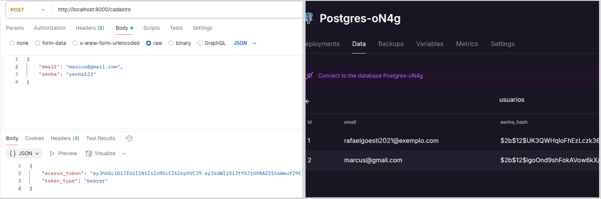

# 🚀 API AUTENTICAÇÃO com FastAPI + PostgreSQL


API completa para cadastro e autenticação de usuários com FastAPI, SQLAlchemy e JWT 🔐.
---

## 🌐 Base URL

```

http://localhost:8000

````

---

## 📌 Endpoints

### 🆕 POST /cadastro

Cria um novo usuário.

- **Request Body:**

```json
{
  "email": "usuario@exemplo.com",
  "senha": "senha123"
}

````
* **Response 201:**

```json
{
  "acesso_token": "string_token_jwt",
  "token_type": "bearer"
}
```

* **Erros:**

| Código | Motivo                |
| ------ | --------------------- |
| 400    | ❌ Email já cadastrado |
| 422    | ⚠️ Dados inválidos    |

---

### 🔐 POST /login

Autentica um usuário existente.

* **Request Body:**

```json
{
  "email": "usuario@exemplo.com",
  "senha": "senha123"
}
```

* **Response 200:**

```json
{
  "acesso_token": "string_token_jwt",
  "token_type": "bearer"
}
```

* **Erros:**

| Código | Motivo                      |
| ------ | --------------------------- |
| 401    | ❌ Email ou senha incorretos |
| 422    | ⚠️ Dados inválidos          |

---

## 📋 Modelos de Dados (Schemas)

### UsuarioCriar

| Campo    | Tipo   | Descrição               |
| -------- | ------ | ----------------------- |
| 📧 email | string | Email válido do usuário |
| 🔒 senha | string | Senha do usuário        |

### UsuarioLogin

| Campo    | Tipo   | Descrição               |
| -------- | ------ | ----------------------- |
| 📧 email | string | Email válido do usuário |
| 🔒 senha | string | Senha do usuário        |

### Token

| Campo            | Tipo   | Descrição              |
| ---------------- | ------ | ---------------------- |
| 🔑 acesso\_token | string | Token JWT gerado       |
| 🆔 token\_type   | string | Tipo do token (bearer) |

---

## 🔐 Segurança

* O token JWT é gerado usando algoritmo **HS256**.
* A validade do token é de **30 minutos** ⏳.
* Use o token no cabeçalho Authorization para endpoints protegidos:

```
Authorization: Bearer <acesso_token>
```

---

## 🧪 Como testar com Postman

1. Envie um `POST` para `/cadastro` com email e senha no corpo JSON para criar um usuário.
2. Receba o token JWT na resposta 🔑.
3. Envie um `POST` para `/login` com email e senha no corpo JSON para autenticar.
4. Use o token JWT no cabeçalho Authorization para acessar endpoints protegidos.

---

## ⚠️ Observações

* 🔒 Senhas são armazenadas como hashes com bcrypt.
* 📧 Emails são únicos.
* 🚫 Requisições mal formatadas retornam erro 422.
* ⚙️ O código pode ser expandido para adicionar novos recursos e endpoints.

---

## 💻 Rodando localmente

1. Instale as dependências:

   ```bash
   pip install -r requirements.txt
   ```
2. Configure o banco no arquivo `DATABASE_URL`.
3. Rode a aplicação:

   ```bash
   uvicorn main:app --reload
   ```

---

### 👨‍💻Desenvolvedores da API
- [Rafael Góes Duarte](https://github.com/rafaelgoesti)
- [Marcus Paulo da Silva Batista](https://github.com/marcusbatistadev)
- [Luan Levi Barbosa de Carvalho](https://github.com/Luan-carvalho-b)
- [Emanuel Rodrigues](https://github.com/emanuelrodrg)
---